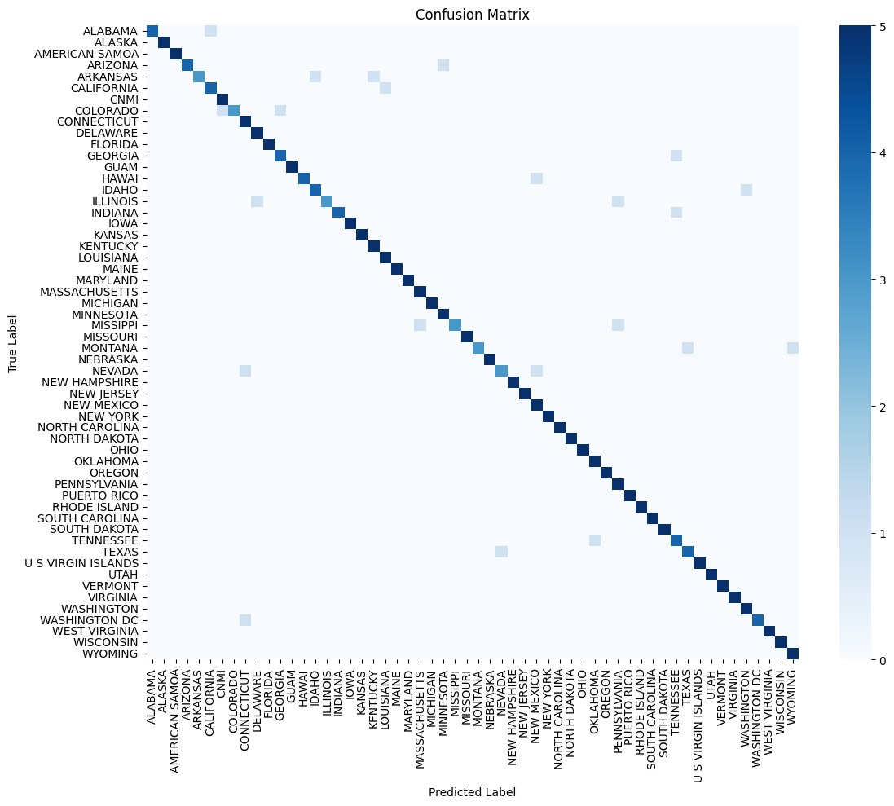
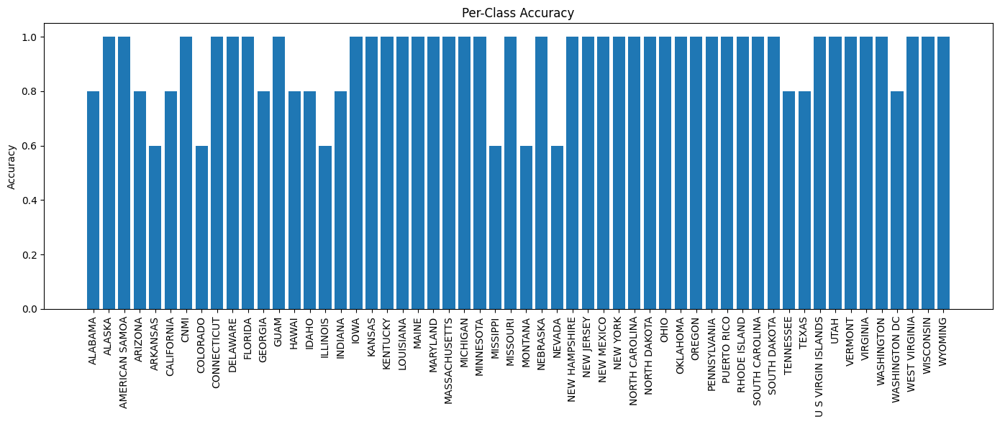

# Project Overview

This folder contains all the files and resources for the final project. Below is an overview of the folder structure and its contents:

## Main Files

- **`train-cnn.ipynb`**: Jupyter Notebook for training a Convolutional Neural Network (CNN) model.
- **`train-svm.ipynb`**: Jupyter Notebook for training a Support Vector Machine (SVM) model.
- **`matplotlib-final-proj.ipynb`**: Jupyter Notebook for generating visualizations and analyzing results.

## Data

The project uses the US License Plates Image Classification dataset:

- **Data Set**: [Kaggle - US License Plates Image Classification](https://www.kaggle.com/datasets/gpiosenka/us-license-plates-image-classification)

## Images

This project includes several visualizations and performance metrics stored as images:

### Confusion Matrices

Located in the `confusionMatrixes/` folder:

- Examples:
  - `A1-cm.png`: Confusion matrix for model A1.
  - `A2-cm.png`: Confusion matrix for model A2.

### Per-Class Accuracy

Located in the `Per_Class_Accuracy/` folder:

- Examples:
  - `a1-per-class-accuracy.png`: Per-class accuracy for model A1.
  - `a2-per-class-accuracy.png`: Per-class accuracy for model A2.

### Train/Test Accuracy and Loss Graphs

Located in the `Train_Test_Accuracy/` and `Train_Test_Loss_Graphs/` folders:

- These folders contain graphs showing the training and testing accuracy and loss over epochs.

### Example Images

Here are a couple of example images from the project:

#### Confusion Matrix (A8)

#### Per-Class Accuracy (A8)

## Report

The file `CSCI_467_Final_Project_Report.pdf` contains the detailed project report, including methodology, results, and analysis.
